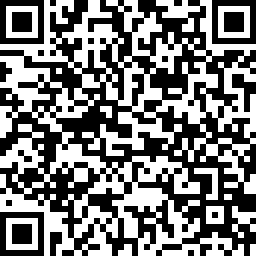

Although I am a software developer – a profession that often requires clarity in the brain – my memory sometimes does not tends to function as I would like it to function. In fact, childhood memories, vacation memories, and also software developing memories often seem to slip away, while at the same time I tend to remember useless facts that are not worth remembering.

To prevent spending time on trying to dig up memories in my software developing journey – “How do I do this and that again?” – I have decided to just write them down. Every time I cannot remember something right away, I will check my own blog first before starting that tiresome digging. A potential positive side-effect might be that you, the reader that is not me, could benefit from this information.

Please consider donating if you have found any of my articles helpful. Any amount is appreciated and would greatly motivate me to continue writing new articles. ❤️

## Contact me

If you have any questions, suggestions for a new article, or if you just want to say hi, you can send me a message at info@ainab.site.
