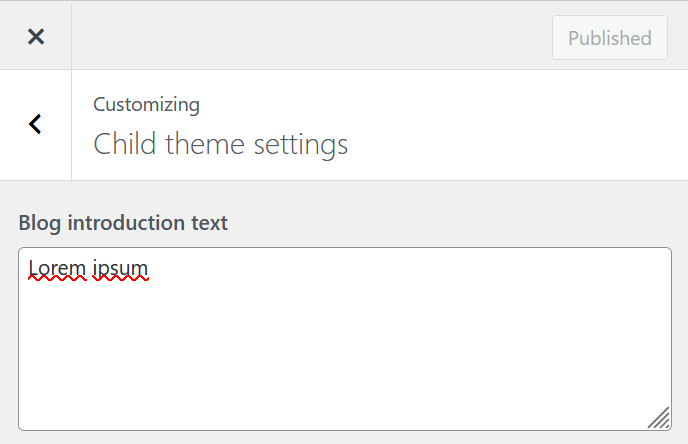

My client asked me to show a short message above every page and post and wished to be able to modify this text himself through the theme customizer.

Now, this is not too hard and I have done it multiple times before, but I keep forgetting the specifics. This post is therefore meant as a quick cheatsheet for myself, but maybe it will help you, anonymous internet user, as well.

First, let us add the specific setting to our theme customizer:

In the `functions.php` of your child theme, add the following lines:

```php
// functions.php

function child\_theme\_customize\_register($wp\_customize)
{
  // This adds the setting to the $wp\_customize object
  $wp\_customize->add\_setting('child\_theme\_blog\_introduction', array(
    'default'   => '',
    'transport' => 'refresh',
  ));

  // This adds a section called "Child theme settings" in which our control will be placed.
  $wp\_customize->add\_section('child\_theme\_settings', array(
    'title'      => \_\_('Child theme settings', 'Child theme'),
    'priority'   => 30,
  ));

  // This adds the control to modify the setting to the newly created section
  $wp\_customize->add\_control(new WP\_Customize\_Control($wp\_customize, 'child\_theme\_blog\_introduction', array(
    'label'      => \_\_('Blog introduction text', 'Child theme'),
    'section'    => 'child\_theme\_settings',
    'settings'   => 'child\_theme\_blog\_introduction',
    'type'       => 'textarea'
  )));
}

// Add the new customizer section, setting and control to your child theme
add\_action('customize\_register', 'child\_theme\_customize\_register');
```

Now, we should be able to see the section and control in the customizer:



Setting control is visible in the correct section in the customizer

To use the value of this setting in your website, use the following code in your template:

```php
// your child theme template

<p>
  <?php
    $introduction\_text = get\_theme\_mod('child\_theme\_blog\_introduction');
    echo esc\_textarea($introduction\_text);
  ?>
</p>
```
