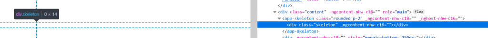

So I was working on creating a nice extendable [skeleton](https://css-tricks.com/building-skeleton-screens-css-custom-properties/) component when I stumbled upon a problem: I wanted to create a base skeleton style for the component that could be extended outside the component using utility classes. Something like this:

```html
// Skeleton template
<div class="skeleton"></div>

// Skeleton CSS
.skeleton {
  background: lightgray;
  width: 100%;
  height: 1em;
  // etc.
}

// Implementation of skeleton component 
// with utility classes
<app-skeleton class="rounded p-1"></app-skeleton>
```

However, what happened during runtime was the following:

```html
<app-skeleton class="rounded p-1">
  <div class="skeleton">
  </div>
</app-skeleton>
```

This meant that my utility classes were not applied to the same element as the skeleton styling, which prevents me from augmenting the base skeleton styling. In fact, the skeleton is not even showing up as the `width: 100%` of the `.skeleton` class has been neutralized by the `app-skeleton` element that surrounds it, giving it an effective width of `0px`:

[](http://ainab.site/wp-content/uploads/2021/06/afbeelding.png)

No skeleton is even showing

After some (soul-)searching I found out it is [possible in Angular](https://angular.io/guide/component-styles#host) to style the component itself using the `:host` pseudo-selector. It is pretty straightforward to use:

```html
// Skeleton template (is empty now)

// Skeleton CSS
:host {
  background: lightgray;
  width: 100%;
  height: 1em;
  // etc.
}

// Implementation of skeleton component 
// with utility classes
<app-skeleton class="rounded p-1"></app-skeleton>
```

Now, the resulting html is as expected:

```html
<app-skeleton class="rounded p-1"></app-skeleton>
```

And the skeleton is subsequently displayed correctly as well, rounded and with a lightgray background:

[](http://ainab.site/wp-content/uploads/2021/06/afbeelding-1.png)

Skeleton is shown as expected
