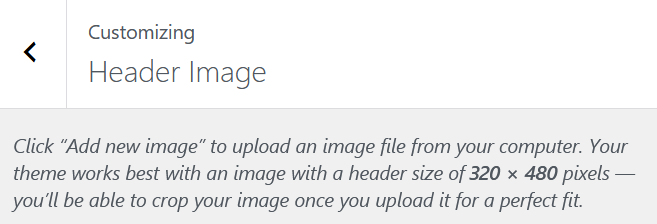

For a client I am currently creating a new website in Wordpress. To speed up design, I am basing my own Wordpress theme on an existing theme: [Twenty Thirteen](https://wordpress.org/themes/twentythirteen/). It is fairly old already (2013), but I like the general layout with a header and navigation on top.

Whenever you upload a header image in this theme, the image would be displayed over the full width of the page. However, I would like to display only a small portrait image in the header of my child theme? How do I do this?

First, let us find out how the custom header is defined in the parent theme. With some research, I found out that the custom header image is defined in `inc/custom-header.php` of the Twenty Thirteen folder.

As usual when we want to override a feature from a parent theme, we copy the file to the same path in our child theme: `twentythirtheenchild/inc/custom-header.php`. To make sure the file gets loaded as well, we register it in `functions.php` of the child theme:

```
/**
 * Add support for a custom header image.
 */
require get_stylesheet_directory() . '/inc/custom-header.php';
```

When checking to see if my website still works, I get an error:

_Fatal error: Cannot redeclare twentythirteen\_custom\_header\_setup() (previously declared in /var/www/html/wp-content/themes/twentythirteenchild/inc/custom-header.php:28) in /var/www/html/wp-content/themes/twentythirteen/inc/custom-header.php on line 26_

Apparently, we are not [allowed to use references to the parent theme](https://stackoverflow.com/a/44047211/4496102) in our own `custom-header.php`. Let us replace all occurrences of the word `twentythirteen` by `twentythirteenchild` (or the name of your very own theme). For example:

```
// File: twentythirteenchild/inc/custom-header.php

function twentythirteen_custom_header_setup() // ...

// becomes

function twentythirteenchild_custom_header_setup() // ...
```

Now we should have successfully copied the custom header into our child theme. However, the header image still looks like the one from the parent theme. Ergo, we have to change the implementation and dimensions of the image.

Currently, the header image is shown as a background image over the full width of the header. This is done by setting the background of the `.site-header` element to the url of the header image:

```
// ... more code
if (!empty($header_image)) :
?>.site-header {
  background: url(<?php header_image(); ?>) no-repeat scroll top;
  background-size: 1600px auto;
}

@media (max-width: 767px) {
  .site-header {
    background-size: 768px auto;
  }
}

@media (max-width: 359px) {
  .site-header {
    background-size: 360px auto;
  }
}

<?php
endif;
// ... more code
```

Remove this whole block of code and make sure the `<?php` opening tag is still there. It should look like this:

```
// ... more code
// If we get this far, we have custom styles.
?>
<style type="text/css" id="twentythirteenchild-header-css">
<?php

// Has the text been hidden?
if (!display_header_text()) :
// ... more code
```

Now, we have removed the header image as a background image, but we still want the image to show as a portrait image in the header.

First, we want to place the header image using a `` element. Copy the `header.php` from `twentythirteen` to the child theme (`twentythirtheenchild`) if you haven't already. In the child theme's `header.php` we will add the `` and inject the header image's url into its `src` attribute:

```
// File: twentythirteenchild/header.php
<header id="masthead" class="site-header" role="banner">

        <?php
        if (!empty(get_header_image())) :
        ?>
	<div>
		" />
	</div>
	<?php
	endif;
        ?>
        <!-- more html -->
</header>
```

And that's it, we now have loaded our custom header image in an image element.

The only thing that is missing now are the image's dimensions. In the parent theme's `custom-header.php`, the image dimensions were defined as 1600 by 230:

```
File: twentythirteen/inc/custom-header.php
function twentythirteen_custom_header_setup() {
	$args = array(
		// Text color and image (empty to use none).
		'default-text-color'     => '220e10',
		'default-image'          => '%s/images/headers/circle.png',

		// Set height and width, with a maximum value for the width.
		'height'                 => 230,
		'width'                  => 1600,

                // etc.
}
```

Let's change this to the dimensions of a portrait image of 480 by 320:

```
function twenythirteenchild_custom_header_setup()
{
	$args = array(
		// Text color and image (empty to use none).
		'default-text-color'     => '220e10',
		'default-image'          => '%s/images/headers/circle.png',

		// Set height and width, with a maximum value for the width.
		'height'                 => 480,
		'width'                  => 320,
           
                // etc.
}
```

And voilá, if we now add a header image through the customize theme page, the dimensions are 320 by 480:



Please let me know if you have any questions or if you see anything that is incorrect.
