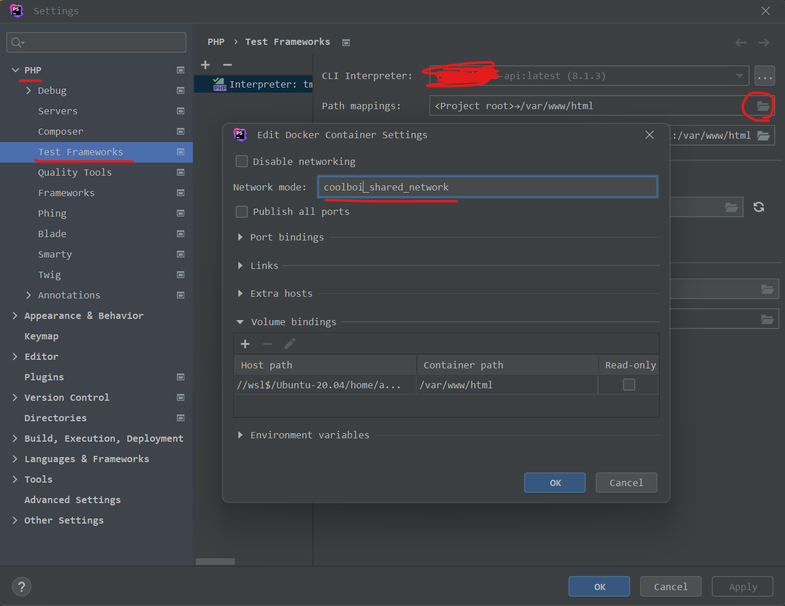

## Problem

I have a Docker setup that consists of:
1. A container that runs PHP
2. A container that runs a MySQL database

I am using PHPStorm for development and I would like to debug my PHPUnit tests that run inside of Docker container #1. However, when I try to do this, I get an error:

```
PDOException : SQLSTATE[HY000] [2002] php_network_getaddresses: getaddrinfo for tms-api-mysql failed: Name or service not known
 /var/www/html/vendor/illuminate/database/Connectors/Connector.php:70
 /var/www/html/vendor/illuminate/database/Connectors/Connector.php:46
 /var/www/html/vendor/illuminate/database/Connectors/MySqlConnector.php:24
 /var/www/html/vendor/illuminate/database/Connectors/ConnectionFactory.php:184
 /var/www/html/vendor/illuminate/database/Connection.php:1064
 /var/www/html/vendor/illuminate/database/Concerns/ManagesTransactions.php:139
 /var/www/html/vendor/illuminate/database/Concerns/ManagesTransactions.php:115
 /var/www/html/vendor/laravel/lumen-framework/src/Testing/DatabaseTransactions.php:17
 /var/www/html/vendor/laravel/lumen-framework/src/Testing/TestCase.php:92
 /var/www/html/vendor/laravel/lumen-framework/src/Testing/TestCase.php:75
 /var/www/html/tests/FeatureTestCase.php:20
  


Time: 00:05.426, Memory: 20.00 MB


ERRORS!
Tests: 1, Assertions: 0, Errors: 1.

Process finished with exit code 2
```

Apparently my PHP Docker container cannot reach my MySQL Docker container.

## Solution

Thanks to [this dude](https://stackoverflow.com/a/70879227/4496102) I was pointed to the fact that I have to configure the correct Docker network in PHPStorm.

First, let's run `docker network ls` to see which networks are there.

```sh
docker network ls

NETWORK ID     NAME                     DRIVER    SCOPE
ad03f4effdb0   tms_api_default          bridge    local
77398733de3b   coolboi_shared_network   bridge    local
5c0edfc1c9d8   wapi_default             bridge    local
38227de74315   web_default              bridge    local
```

My Docker containers are on the `coolboi_shared_network` so we need to configure PHPUnit to use this Docker network.

Go to `File > Settings > PHP > Test Frameworks`



I have one Test Framework configured already and assume you have already as well.

On the far right of the `Docker container: [...:...] 📂` row, click the folder icon button.

Then, in the text input next to `Network mode:`, you should see a value that does not equal the network we would like it to use. Mine had `bridge` as the value.

Input the name of your desired network (`coolboi_shared_network` in my case).

Try to debug again and everything _should_ go fine now:
```
Time: 00:00.391, Memory: 30.00 MB

OK (1 test, 6 assertions)

Process finished with exit code 0
```
