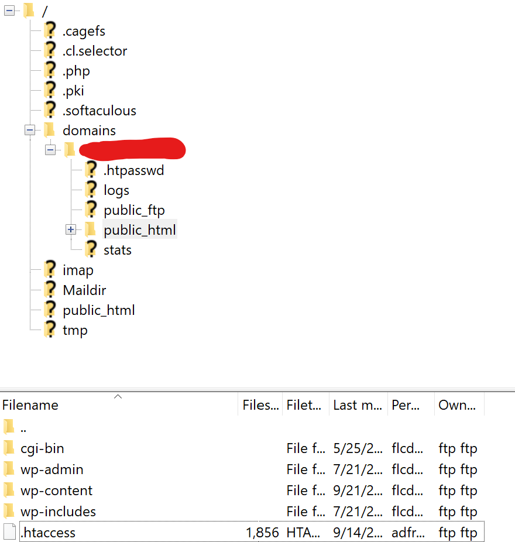

You have finally installed that SSL certificate to your website and now the website keeps hanging in an unsafe http connection. What is up with that?

To force a HTTPS connection, we only have to add some lines to the `.htaccess` file, which is located in the root of the public html folder of your WordPress website:



.htaccess is located in the public html folder of your WordPress website, which is the same folder that contains the wp-admin, wp-content, and wp-includes folder.

Download the `.htaccess` file from your FTP server, open in your editor, and look for the following line:

```apache
RewriteEngine On
```

If this line exists in the file, append two lines so that it looks like this:

```apache
RewriteEngine On
RewriteCond %{HTTPS} off 
RewriteRule ^(.\*)$ https://%{HTTP\_HOST}%{REQUEST\_URI} \[L,R=301\]
```

If the line did not yet exist, add the following content to your `.htaccess` file:

```apache
\# BEGIN WordPress
# The directives (lines) between "BEGIN WordPress" and "END WordPress" are
# dynamically generated, and should only be modified via WordPress filters.
# Any changes to the directives between these markers will be overwritten.
<IfModule mod\_rewrite.c>
RewriteEngine On
RewriteRule .\* - \[E=HTTP\_AUTHORIZATION:%{HTTP:Authorization}\]
RewriteBase /
RewriteRule ^index\\.php$ - \[L\]
RewriteCond %{REQUEST\_FILENAME} !-f
RewriteCond %{REQUEST\_FILENAME} !-d
RewriteRule . /index.php \[L\]
RewriteCond %{HTTPS} off 
RewriteRule ^(.\*)$ https://%{HTTP\_HOST}%{REQUEST\_URI} \[L,R=301\]
</IfModule>

# END WordPress
```

Save the file and upload it back to your FTP server. HTTPS connections should now be forced.
