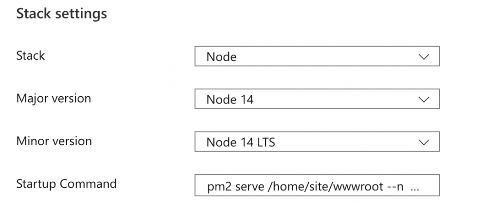

Building an Angular app usually results in a bunch of files, mainly consisting of Javascript files, CSS files, and an `index.html`.

An Azure App Service normally wants to host an application using a startup command for a specific stack (PHP, Node, Python, etc.).

Technically, you could run your Angular app as a Node app. In that case you would run `npm run start` or `ng serve` as the startup command.

But when you have a static build generated using `ng build`, you cannot do that. Instead, you want to serve the folder with the files from the build.

This is possible in Azure App Service, although it was a little hard to find ([thanks Lutti Coelho on Stackoverflow](https://stackoverflow.com/a/61386411/4496102)). Simply select Node as your stack and then use the following [PM2](https://pm2.keymetrics.io/) startup command:

```shell
pm2 serve /home/site/wwwroot --no-daemon --spa
```

This will make PM2 serve your `wwwroot` folder. As a reference, my configuration looks as follows:



Azure App Service Stack settings
