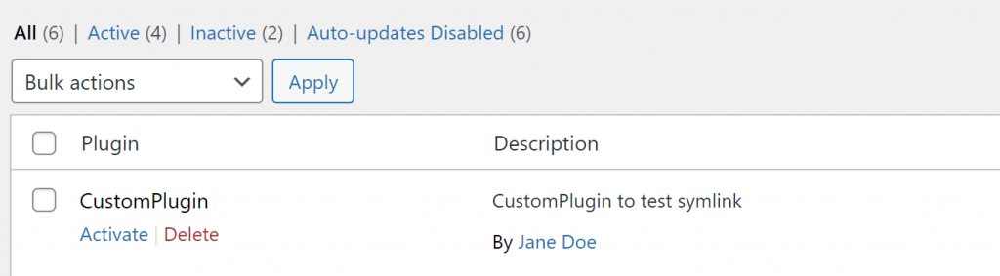
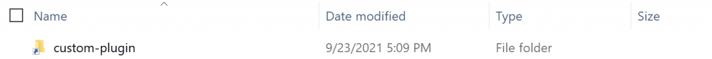

Since a while, I have been using Flywheel's Local for my local WordPress development server and it has been. No time spend on configuration Docker, Apache, database connections, et cetera.

However, one thing that has been bugging me is the question of how to combine Local's configuration and my own code, which contains my WordPress themes and plugins. As Local creates its own WordPress folders (wp-content etc.) inside its configuration folders, how should I approach such a situation?

One option would be to create one big repository, containing the Local configuration and the WordPress folders, including my custom themes and plugins. But then I need to navigate to those nested folders every time I want to continue development. And do I really need Local's configuration files inside my repository?

Another option would be to create a git repository inside the wp-content folder, or in the themes / plugin folder. But then my git repository would be deeply nested in the Local configuration folders and I like to have all my project repositories in a central place.

A better way, then, would be to separate the repository from the Local folders. Suppose we are developing a plugin which is currently in the following folder structure:

```generic
\# Local always sets up the website inside the user directory, e.g.:
# C:\\Users\\JaneDoe\\Local Sites\\jane-doe-website

jane-doe-website
- app
  - public
    - wp-content
      - plugins
        - custom-theme
```

But we would like to have the following situation:

```generic
jane-doe-website
- app
  - public
    - wp-content
      - plugins
        - custom-plugin (symlink to repository)
          - plugin.php

repositories
- jane-doe-website-custom-plugin
  - plugin.php
```

We can achieve this using symlinks. A symlink is basically a reference to another folder. This enables us to separate our plugin repository from the Local folder structure. Inside Local's nested plugins folder we should create a symlink to our plugin repository folder. In Windows, you can do this using the `mklink` command. The syntax is as follows: `mklink <link> <target>`. Because we are creating a symlink between two directories, we also supply the `/D` parameter. The resulting command (execute as Administrator) will then be as follows in Windows:

#### Create a symlink in Windows using command prompt

```shell
\# Windows command prompt
mklink /D "C:\\Users\\JaneDoe\\Local Sites\\jane-doe-website\\app\\public\\wp-content\\plugins\\custom-plugin" "C:\\Users\\JaneDoe\\repositories\\custom-plugin"
```

If successful, the response should be something like:

```shell
symbolic link created for C:\\Users\\JaneDoe\\Local Sites\\jane-doe-website\\app\\public\\wp-content\\plugins\\custom-plugin <<===>>> C:\\Users\\JaneDoe\\repositories\\custom-plugin
```

#### Create a symlink on macOS / linux

On macOS or linux, creating a symlink is slightly different:

- We use the `ln` command
- The order of link / target is inversed compared to Windows, e.g. `<target> <link>` instead of vice versa.
- The link folder is the parent folder, e.g. `plugins` instead of `plugins/custom-plugin`
- No response is a successful response

```shell
\# macOs / linux
ln -s /Users/JaneDoe/repositories/custom-theme "/Users/JaneDoe/Local Sites/jane-doe-website/app/public/wp-content/plugins"
```

When we now navigate to Wordpress, assuming you have a working plugin, we should now see our custom plugin:



The plugin should appear when the symlink was created successfully.

And in Windows, it should look like this:



A symlink looks like a shortcut. Screenshot taken from Local's WordPress plugins folder.

Now, your plugin repository has been separated from Local's configuration folders. No bloat in your repository, no nested folders and no risk in deleting the WordPress folders in Local.

If you want to break the symbolic link, simply remove the symlink folder from your Local folder using windows explorer, or by [using the `rmdir` command](https://superuser.com/a/306618/519768).
