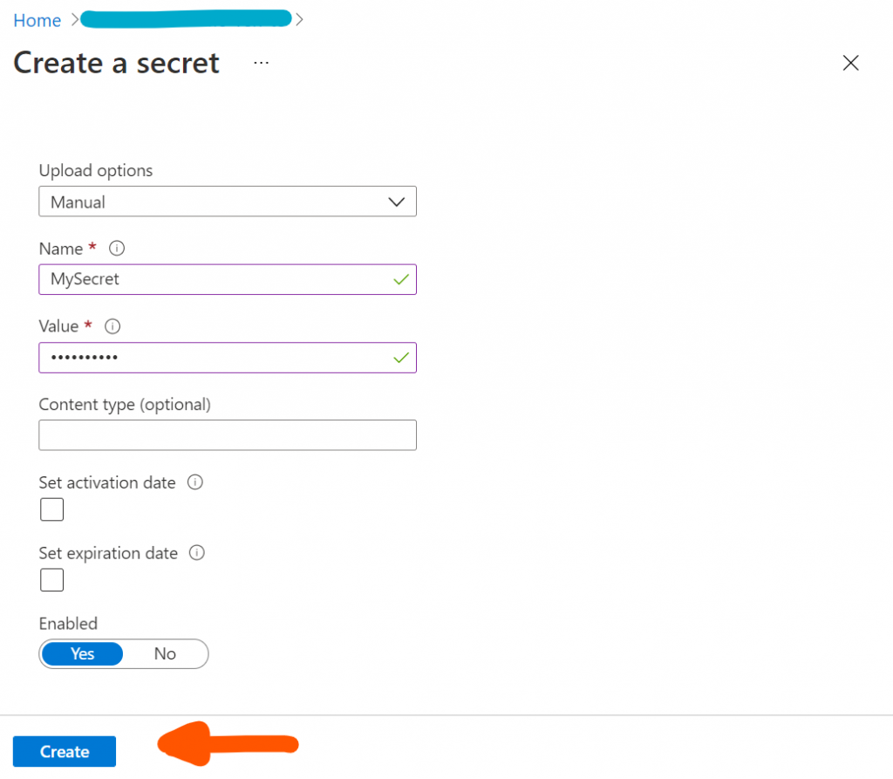
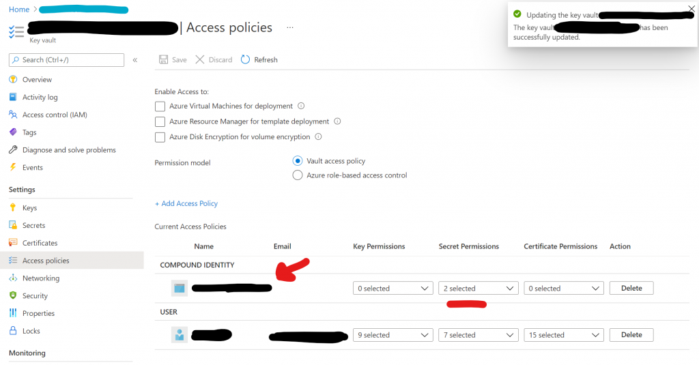

## 1\. Make sure the function app has a managed identity

Go to your Azure Function App and then go to Settings > Identity. Switch the status from `off` to `on`.


Enabling System assigned managed identity in the Azure Function App

## 2\. Create a Secret in the Azure Key Vault

Go to your Azure Key Vault and then go to Settings > Secrets. Click `+ Generate/Import`.


Navigating towards Secrets in the Azure Key Vault

Then, give your Secret a name and a value and click the `Create` button. Remember the name of the Secret, we will need it later.



Configuring the Secret

## 3\. Give the Function App access to the Key Vault

Go to your Azure Key vault, navigate to Settings > Access policies and click `+ Add Access Policy`.


Navigating towards Access policies

On the `Add access policy` page, configure the following values:

- Configure from template (optional) > Secret management
- Key permissions > 0 selected
- Secret permissions >
    - Secret Management Operations > Get & List
- Certificate permissions > 0 selected


Configuring the secret permissions of the access policy

Under `Select principal *`, click on `None selected`. A side menu appears. In this side menu search for the managed identity you have created earlier in Step 1. It should have the same name as your function app. When you have found it in the list of search results, click it to select it. Then, click the `Select` button on the bottom.


Adding the principal in the `Add access policy` configuration

Then, repeat the exact same steps for the `Authorized application`: Under `Authorized application`, click `None Selected`. Now search for your function app. Click on your function app in the search results to select it. Click the `Select` button to finalize the selection.


Adding the Authorized application in the `Add access policy` configuration

Finally, click the `Add` button to finalize adding the access policy.


Finalizing adding the access policy

Once finished adding, it should like in the image below:



## 4\. Adding the Key Vault Secret as a Function App Configuration Variable

We will now import the Secret into a Configuration Variable in the Function App so it can be used from within the app.

First, go to the Secret we created in step 2. and click on the Secret to view its configuration details.


Navigating to the newly created Secret

Click on the current version.


Going to the current version

Click on the `Copy to clipboard` icon to copy the `Secret Identifier` to the clipboard.


Copying the `Secret Identifier`

Go back to your Function App, go to Settings > Configuration and click on `+ New application setting`.


Now comes the tricky part. The `Secret Identifier` we have just copied to the clipboard must placed in the following string at the place of the `{secret identifier}` placeholder:

```generic
@Microsoft.KeyVault(SecretUri={secret identifier})
```

Which then should look something like this:

```generic
 @Microsoft.KeyVault(SecretUri=https://my-function-app.vault.azure.net/secrets/ClientSecret/59e4d9a120ea4b1cad7158925fd913d3})
```


## 5\. Using the Secret in your Function App

In your Function App you can now get the value of the Secret by using the following line of code:

```csharp
var mySecret = Environment.GetEnvironmentVariable("MySecret", EnvironmentVariableTarget.Process);
```

I hope this helped you, it certainly helped my memory!
