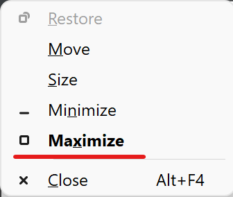

As I frequently disconnect and connect monitors from and to my laptop, a bug(?) in Windows 11 causes the windows of application to disappear sometimes. This usually happens with `[Zettlr](https://www.zettlr.com/)`, my note-taking app of choice. This frustrated me endlessly, as I want my notes to be easily accessible. But now I think I found a solution to make the window appear again.

Simply press `alt + space` whenever the disappeared window is active. This should open the window context menu:

Window context menu

I then click `Maximize` and the window will then maximize on my main (laptop) screen and will therefore be visible again.
