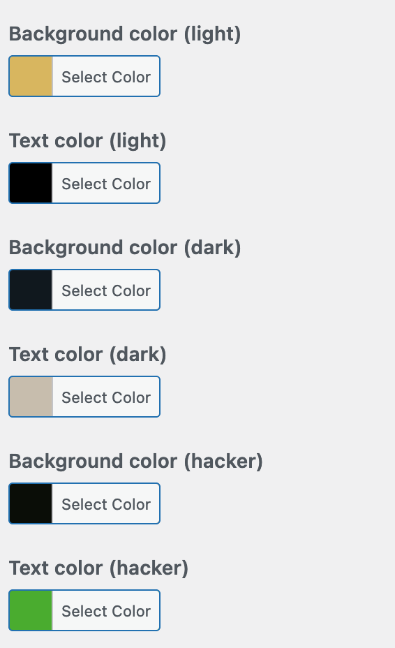

I am currently working on dark mode support for a Wordpress theme. For that, the website will need to use different colors depending on the preference of the user. At the same time, I want those colors to be easily customizable through Wordpress' Customizer.

What I don't want, however, is 500 lines of code just to add a few colors. The hooks for adding Wordpress customizer [settings](https://developer.wordpress.org/reference/classes/wp_customize_manager/add_setting/) and [controls](https://developer.wordpress.org/reference/classes/wp_customize_manager/add_control/) are no one-liners. Better, then, would be to abstract adding the colors and put them in some sort of for-loop. Simply add the following code to your `functions.php` and customize `$custom_colors` to your liking:

```php
<?php

// file: functions.php 
// source: https://gist.github.com/drikusroor/7b0be90bd9dc2de9deed870e621611c1

function my\_theme\_add\_setting\_control($wp\_customize, $color, $options)
{

  $key = $color\[0\];
  $label = $color\[1\];
  $default\_hex = $color\[2\];

  $section = $options\['section'\];
  $text\_domain = $options\['text\_domain'\];

  $wp\_customize->add\_setting($key, array(
    'default'           => $default\_hex ?? '#000',
    'sanitize\_callback' => 'sanitize\_hex\_color',
    'capability'        => 'edit\_theme\_options',
    'type'           => 'option',
  ));

  $wp\_customize->add\_control(new WP\_Customize\_Color\_Control($wp\_customize, $key, array(
    'label'    => \_\_($label, $text\_domain),
    'section'  => $section,
    'settings' => $key,
  )));
}

function my\_theme\_customize\_register($wp\_customize)
{
  $options = \['section' => 'colors', 'text\_domain' => 'my\_theme'\];

  $custom\_colors = \[
    \['my\_theme\_light\_bg\_color', 'Background color (light)', '#d8b65f'\],
    \['my\_theme\_light\_text\_color', 'Text color (light)', '#000000'\],
    \['my\_theme\_dark\_bg\_color', 'Background color (dark)', '#10181E'\],
    \['my\_theme\_dark\_text\_color', 'Text color (dark)', '#C7BDAD'\],
    \['my\_theme\_hacker\_bg\_color', 'Background color (hacker)', '#0A0D07'\],
    \['my\_theme\_hacker\_text\_color', 'Text color (hacker)', '#4AAC2F'\],
  \];

  foreach ($custom\_colors as $color) {
    my\_theme\_add\_setting\_control($wp\_customize, $color, $options);
  }
}

add\_action('customize\_register', 'my\_theme\_customize\_register');

?>
```

The aforementioned [gist](https://gist.github.com/drikusroor/7b0be90bd9dc2de9deed870e621611c1) adds settings and controls for six configurable custom colors to the colors section (see `$options`). The color ids, labels and default values are configured in `$custom_colors`.

When we go to our theme's Customizer and then to the colors section, it should look like this:



Custom colors in the Wordpress theme's Customizer
