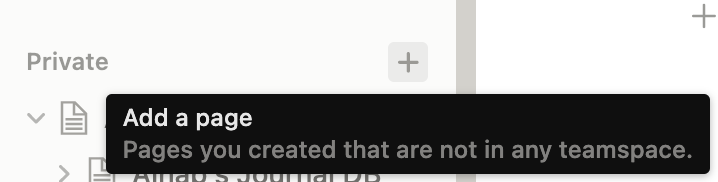
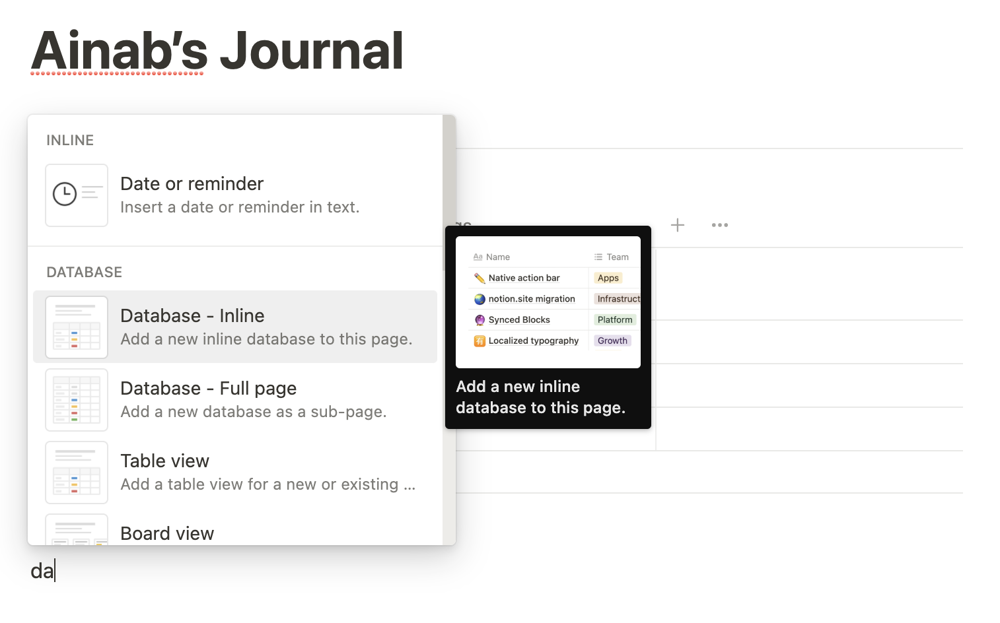
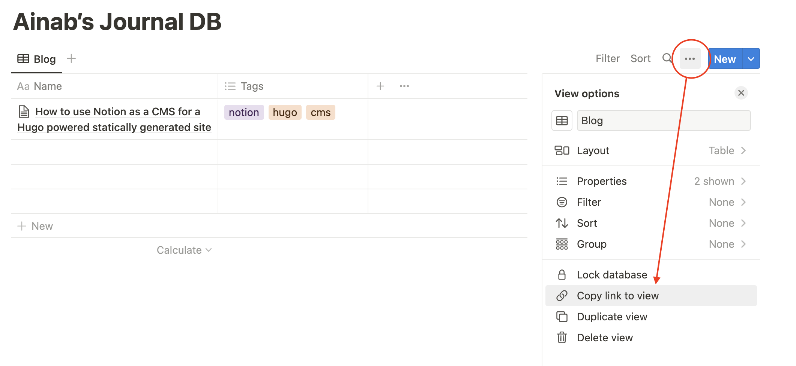
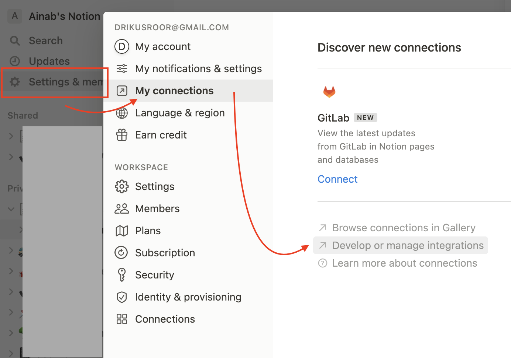
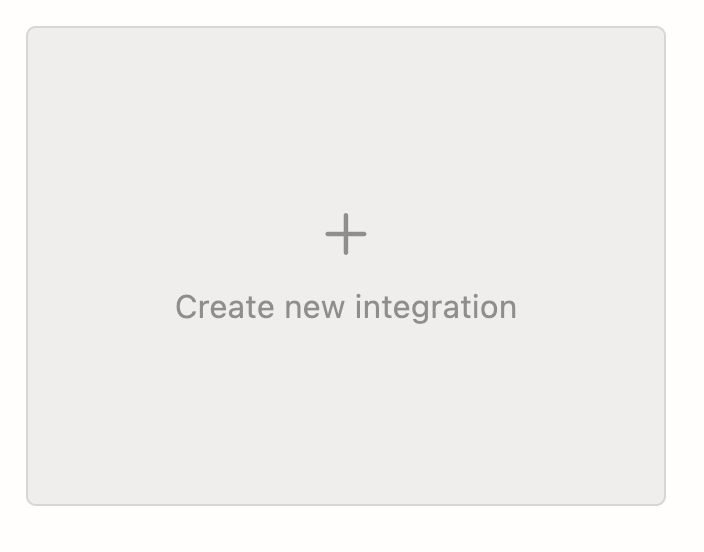
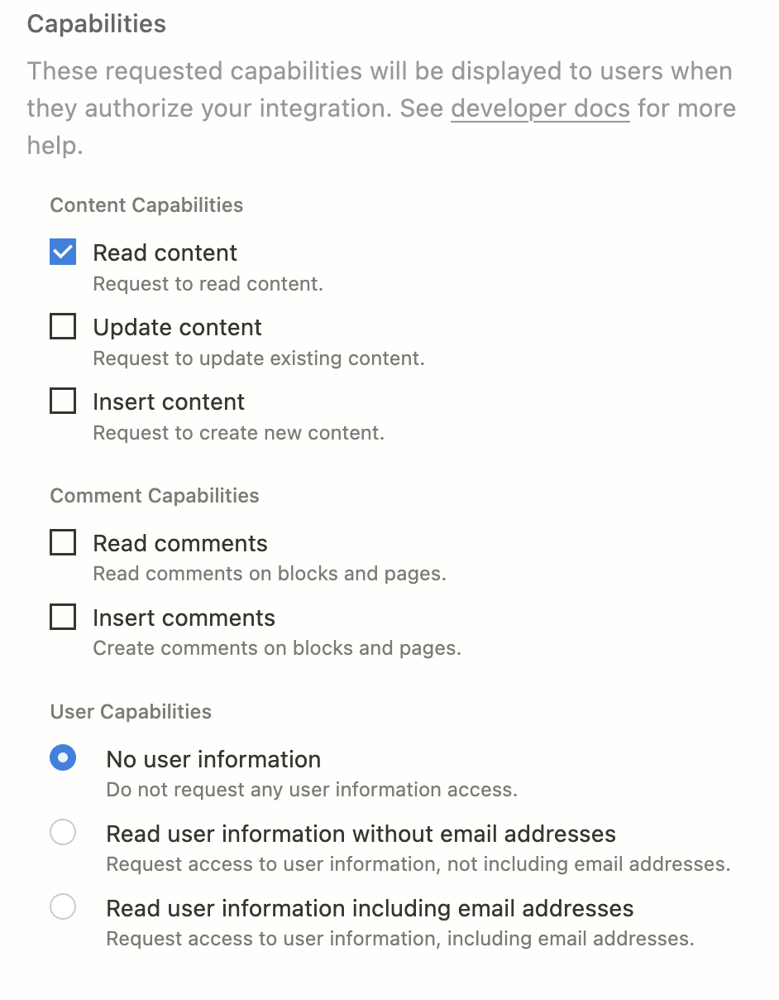
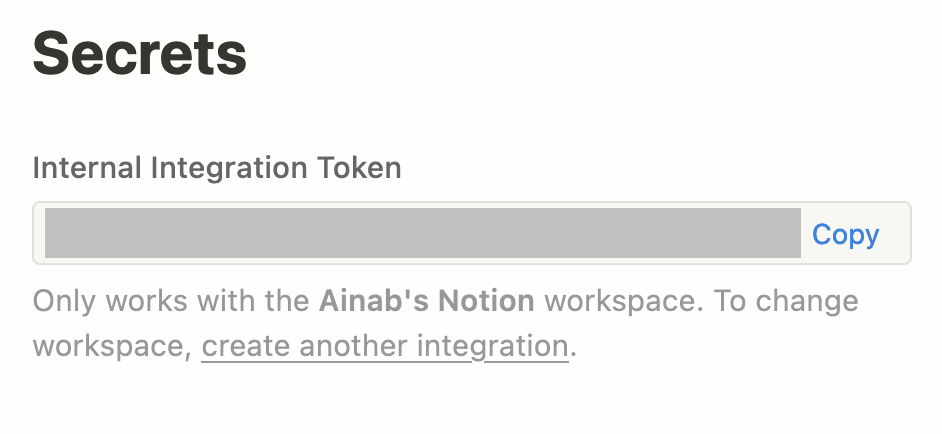
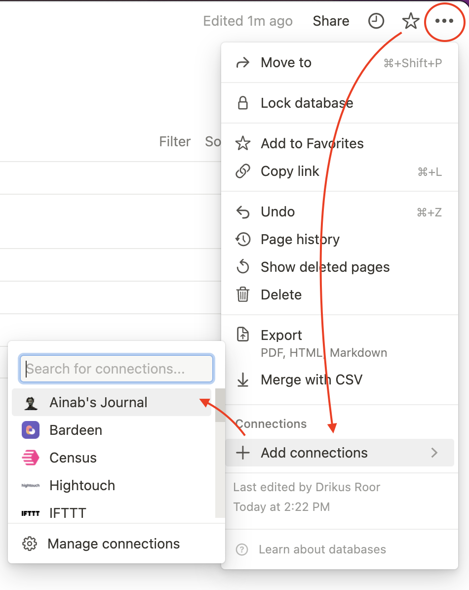

This website is created using Hugo, the static site generator. I use Markdown for the posts. These posts exist in a Github repository and Github Actions makes sure the site gets generated and deployed everytime I make a commit. However, for a new post I have to open my code editor and start writing in Markdown. This can be a hassle sometimes.


So then I thought: Can’t I use Notion to write the posts and then import them into the Hugo build as markdown using Github Actions, automated? And the answer is yes.


This post describes my journey and the steps to make that possible. If you read this on my website, [Ainab’s Journal](https://ainab.site), it means I have succeeded as I’m currently writing this post in Notion. If you are not reading this article, then I can write all kinds of crazy stuff that would maybe hurt me in the future. But I shall remain positive and assume I will succeed.


First, I will describe my journey. If you are impatient like me, you can also jump to the **TL;DR (click)** for the steps you need to take.


First thing I found was this article **Using Notion as a CMS**: 


[bookmark](https://www.thisdot.co/blog/using-notion-as-a-cms)


The instructions were not complete, but I could get the gist of it:

- Create a Notion database that will contain the blog posts
- Create a readonly Notion integration
- Use the Database ID and the integration secret to fetch the posts

Unfortunately, the post does not describe where to get the Database ID, but I’ll get back to that later.


## 1. Create a database


First, create a post that will contain your database. I called my post _Ainab’s Journal_, because that’s what it is.





Then, in the newly created page create an inline database view:





## 2. Copy Database ID


I could not find the instructions for getting the Database ID in the aforementioned post, so I looked further. Luckily the [hive mind of Stackoverflow.com came to the rescue](https://stackoverflow.com/a/69860478/4496102) and told me the Database ID is to be found in the link to the database view.


Click the three-dotted edit button of the database view and click _Copy link to view_. 





Paste the copied link to an editor. It should have the following format:


```text
https://www.notion.so/<long_hash_1>?v=<long_hash_2>

# or if you configured a Notion domain for yourself:

https://www.notion.so/<notion-domain-name>/<long_hash_1>?v=<long_hash_2>
```

1. The first hash contains the **Database ID**. This one is <u>important</u>.
2. The second hash contains the **View ID**. This one is <u>less</u> important.

Now that we have the Database ID, we can move on to creating a Notion Integration and getting its secret.


## 2. Creating a Notion Integration


A Notion Integration allows other applications to read (or modify) data from a workspace’s pages and databases. In this case, we will create a readonly integration without comments that allows Hugo to fetch all the posts from the Notion database.


First, go to Settings & members → My connections → Develop or manage integrations:





Click _Create a new integration_:





Give it a name and logo to your liking. Make sure you uncheck Update content, Insert content, Read comments, and Insert comments (see image). Also, we need no user information. Hit submit.





After submitting the form, Notion will show you a next screen that allows you to copy the secret. Click _Show → Copy_ (see screenshot below). Store the secret somewhere safe.





## 3. Connect integration


Now that we have all the information we need (or so I thought), we can start testing fetching the data from our database. [This post](https://blog.postman.com/how-to-explore-notion-api-postman-public-workspace/) nudged me into the right direction, although some information turned out to be missing in the end. I used Insomnia to create the following HTTP request:


```text
URL: https://api.notion.com/v1/databases/{databaseId}
Method: GET
Headers:
	Authorization: {integrationSecret}
```


However, this returned me the following error message:


```json
{
	"object": "error",
	"status": 400,
	"code": "missing_version",
	"message": "Notion-Version header failed validation: Notion-Version header should be defined, instead was `undefined`."
}
```


Apparently, [we need to send along](https://developers.notion.com/changelog/unversioned-requests-no-longer-accepted) the `Notion-Version` header in this request since June 1, 2021. The version mentioned in the article is `2021-05-11`. It might be superseded by new versions already, so you might want to check that out.


So anyways, I added that header:


```text
URL: https://api.notion.com/v1/databases/{databaseId}
Method: GET
Headers:
	Authorization: {integrationSecret}
	Notion-Version: 2021-05-11
```


But received the following error:


```json
{
	"object": "error",
	"status": 404,
	"code": "object_not_found",
	"message": "Could not find database with ID: ea464d0c-09ee-4903-ad83-809256af0b4b. Make sure the relevant pages and databases are shared with your integration."
}
```


Apparently, I need to make sure that `Make sure the relevant pages and databases are shared with your integration.` This was mentioned already in the earlier mentioned [Stackoverflow answer](https://stackoverflow.com/a/69860478/4496102) but I assumed this just meant copying the link. Apparently not! I also let out a little sigh of relief because I was afraid that the integration would automatically gain access to _all_ my posts. Fortunately this is not the case.


Copying the link to the **view** is done in the **view settings**, but **connecting the integration** to the **database** is done in the **database settings**. Initially I couldn’t find those settings, but eventually I found them in the top-right of the window:





When I now execute the same HTTP request I get a successful response with information about my database:


```json
{
	"object": "database",
	"id": "ea464d0c-09ee-4903-ad83-809256af0b4b",
	"cover": null,
	"icon": null,
	"created_time": "2022-11-19T11:38:00.000Z",
	"created_by": { ...	},
	"last_edited_by": { ...	},
	"last_edited_time": "2022-11-19T13:28:00.000Z",
	"title": [
		{ ... }
	],
	"description": [],
	"is_inline": true,
	"properties": {
		...
	},
	"parent": {
		"type": "page_id",
		"page_id": "84c4e4d5-701e-4948-ae27-0b271fa854d3"
	},
	"url": "https://www.notion.so/ea464d0c09ee4903ad83809256af0b4b",
	"archived": false
}
```


## 4. Fetch pages


This only contains information about the database though. We actually want to fetch the individual posts. After [a quick look](https://developers.notion.com/reference/post-database-query) on the official Notion API Reference, I found the following endpoint:


```json
URL: https://api.notion.com/v1/databases/{databaseId}**/query**
Method: **POST**
Headers:
	Authorization: {integrationSecret}
	Notion-Version: 2021-05-11
```


It’s basically the same as the earlier endpoint, but `/query` is appended to the url and the method is now `POST`. Furthermore, as the endpoint name suggests, it allows you to do queries using [filters](https://developers.notion.com/reference/post-database-query-filter).


When I executed the command without a filter, it returned me all the pages, including some random empty pages thad made no sense to me. These random pages had no title. Therefore, I wanted to query only the pages that have a title. I added the following JSON body to the request:


```json
{
	"filter": {
		"property": "Name",
		"text": {
			"is_not_empty": true
		}
	}
}
```


This returned me the following response:


```json
{
	"object": "list",
	"results": [
		{
			"object": "page",

			// Page ID
			"id": "x-xxxx-xxxx-xxxx-xxxx",

			"created_time": "2022-11-19T11:38:00.000Z",
			"last_edited_time": "2022-11-19T15:03:00.000Z",
			"created_by": {...},
			"last_edited_by": {...},
			"cover": null,
			"icon": null,
			"parent": {...},
			"archived": false,
			"properties": {
				"Tags": {...},
				"Name": {
					"id": "title",
					"type": "title",
					"title": [
						{
							"type": "text",
							"text": {
								"content": "How to use Notion as a CMS for a Hugo powered statically generated site",
								"link": null
							},
							"annotations": {...},
							"plain_text": "How to use Notion as a CMS for a Hugo powered statically generated site",
							"href": null
						}
					]
				}
			},
			"url": "https://www.notion.so/How-to-use-Notion-as-a-CMS-for-a-Hugo-powered-statically-generated-site-x-xxxx-xxxx-xxxx-xxxx"
		}
	],
	"next_cursor": null,
	"has_more": false
}
```


## 5. Fetch page content


The information we want here is the page id, which we can use to retrieve the page content aka the “blocks”. [According to the API Reference](https://developers.notion.com/reference/retrieve-a-page), we can use the following request for that:


```json
URL: https://api.notion.com/v1/blocks/{pageId}
Method: GET
Headers:
	Authorization: {integrationSecret}
	Notion-Version: 2021-05-11
```

