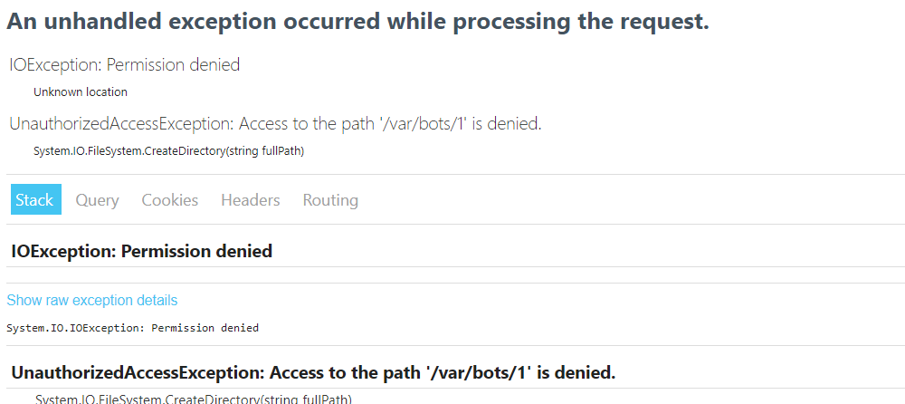

For an upload feature, my .NET application needs to upload a file to a newly created directory. My application is running as a linux service. Whenever the application tries to create a folder and add the file, I get an `IOException`:



An unhandled exception occurred while processing the request. IOException: Permission denied.

At first, I though I'd just `chmod 777` the `/var/bots` folder and give full write permissions. It worked, but it would probably not be a viable and secure solution for the long term.

I then checked on which user the service was running by running the following [command](https://ainab.site/2021/11/12/repository-of-convenient-terminal-commands/):

```shell
ps -ef
```

The service was running on the `dotnetapp` user. I then changed the owner of `/var/bots` to this `dotnetapp` user by using the `chown` command:

```shell
sudo chown dotnetapp /var/bots
```

Et voila, no more `IOException` errors and the app could now create folders and files inside of the `/var/bots` folder.
