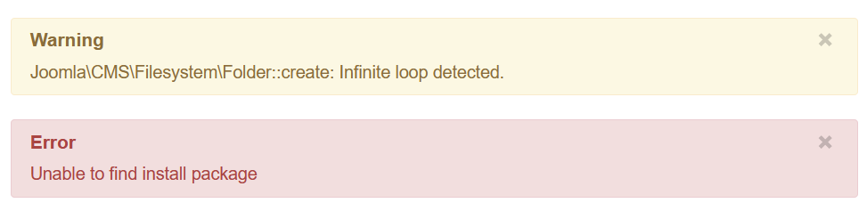
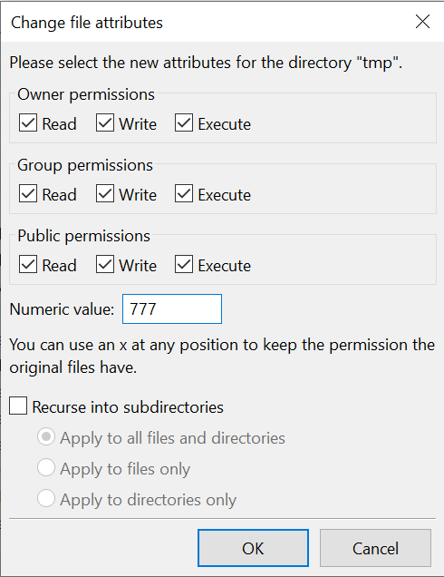
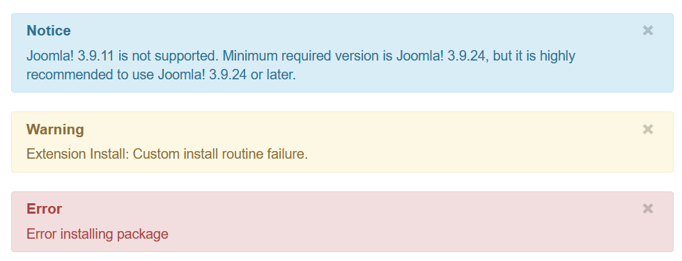

Today, I tried to install an extension to a Joomla website I am currently working on. However, I got an error message, saying:

```
Warning
Joomla\CMS\Filesystem\Folder::create: Infitinite loop detected.

Error
Unable to find install package
```



A quick search on Google taught me it has something to do with the file permissions on the `logs` and `tmp` folders. They need to be writable. So, using Filezilla, I set the file permissions of these folders to `777`:



Setting the file permissions of `tmp` to `777`.

But when I try to install the extension again, I get the same error. Apparently my `configuration.php` contained invalid paths to the `logs` and `tmp` folders. As this Joomla website was a clone from an earlier Joomla website I made, it still contained the absolute paths to the old website's location on the server.

The solution was therefore to update these paths:

```
public $log_path = '/home/{old-user}/domains/{old-domain.com}/public_html/administrator/logs';
public $tmp_path = '/home/{old-user}/domains/{old-domain.com}/public_html/tmp';
```

To:

```
public $log_path = '/home/{new-user}/domains/{new-domain.com}/public_html/administrator/logs';
public $tmp_path = '/home/{new-user}/domains/{new-domain.com}/public_html/tmp';
```

Note the differences between not only the domains, but also the user and the fact that my `logs` folder is located in the `administration` folder.

Now, my `Infinite loop detected` error is gone. I hope this helps you when you encounter the same problem.

However, I now have a new error:



Extension Install: Custom install routine failure.

This error could be resolved by simply updating Joomla in `Components > Joomla! Update` and therefore does not deserve its own post.
