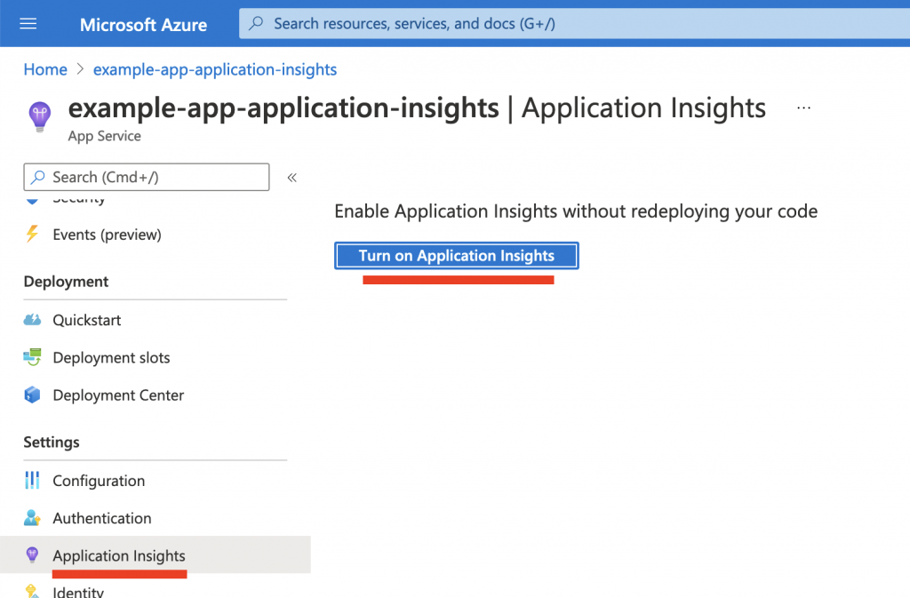
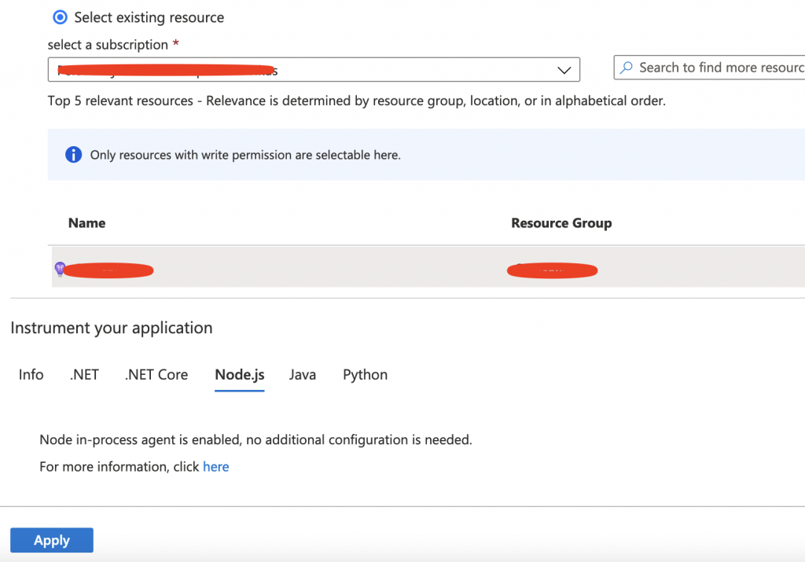
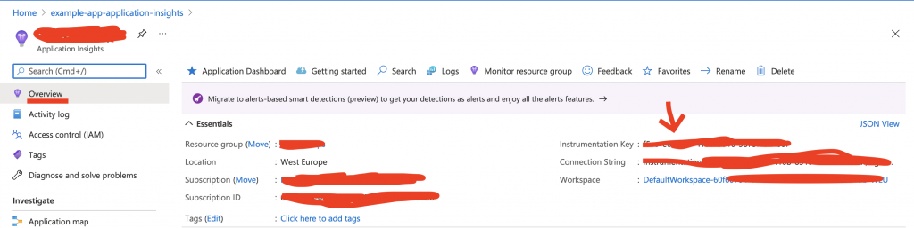
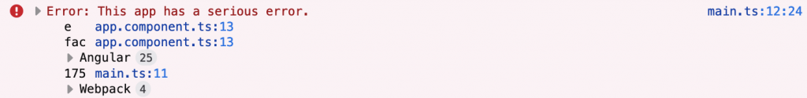
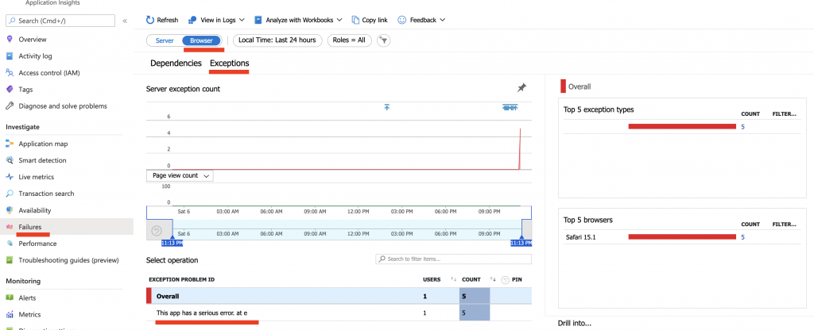
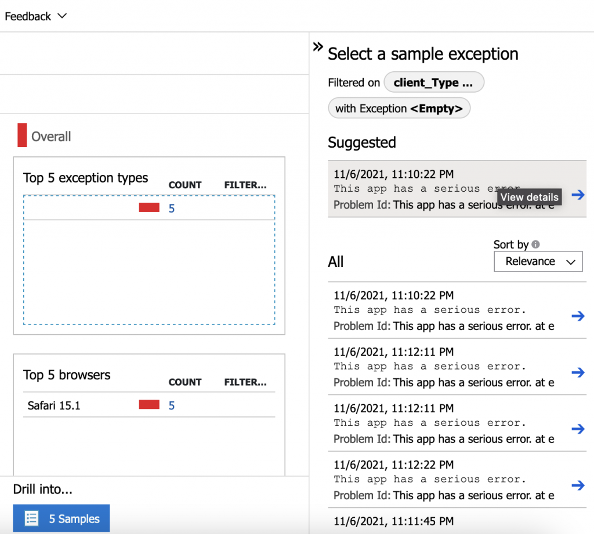
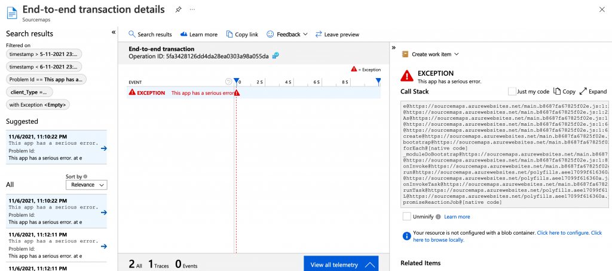

As there is no software without bugs, we must always assume there are bugs in our software. Subsequently, it would be very nice if we would be aware of those bugs as well. We cannot always be aware of all the bugs in our software, but we can be aware of all exceptions that occur in our software, using logging and telemetrics services.

One of those services is Azure's Application Insights which, among doing many other things, can collect browser exceptions coming from Javascript-based single page applications and provide much useful information about them.

This article provides a guide for handling errors occurring in an Angular app and subsequently logging these errors to Application Insights. The guide consists of three parts:

1. Configuring Application Insights for an Angular app hosted on an Azure App Service
2. Configuring an Angular app to catch all errors and log them to Application Insights
3. A short overview of how to verify everything was configured and what it should look like in Application Insights

Now, let's start!

First, make sure that Application Insights is configured for the Azure app service that runs your app. Go to your app service and go to the `Application Insights` setting. Turn on Application Insights.

### 1\. Configure Application Insights for your Angular App Service



Turn on Application Insights

I already had an existing resource with an Application Insights instance which I will select here. Of course, feel free to create to your own resource if you do not already have one. To finish the process, click `Apply` and click `Yes` on the dialog that pops up.



Create new / Select existing resource

Now go to your Application Insights instance and copy the instrumentation key. We will need it later on.



Copy the instrumentation key (on the right) from your Application Insights overview

### 2\. Configure your Angular app to log errors to Application Insights

#### 2.1 Add the Application Insights Instrumentation Key

First, make sure you have an `environment.ts` file in your folder structure. There should be one located in `your-app/src/environments`.

There, add the following `appInsights` entry to the environment configuration object. Use the instrumentation key we copied in step 1.

```typescript
appInsights: {
  instrumentationKey: '<your-guid>'
}
```

Your `environment.ts` file should look like this now:

```typescript
export const environment = {
  // More configuration
  appInsights: {
    instrumentationKey: '<your-guid>'
  }
  // More configuration
};
```

#### 2.2 Add the application insights library

Then, install the application insights library using:

```shell
npm i @microsoft/applicationinsights-web -s
```

#### 2.3 Add the logging service

Now, we will create a LoggingService in our appthat will log events and exceptions. Create the file `src/app/services/logging.service.ts` and give it the following content:

```typescript
// src/app/services/logging.service.ts

import { Injectable } from '@angular/core';
import { ApplicationInsights } from '@microsoft/applicationinsights-web';
import { environment } from 'src/environments/environment';

@Injectable()
export class LoggingService {
  appInsights: ApplicationInsights;
  constructor() {
    this.appInsights = new ApplicationInsights({
      config: {
        instrumentationKey: environment.appInsights.instrumentationKey,
        enableAutoRouteTracking: true // option to log all route changes
      }
    });
    this.appInsights.loadAppInsights();
  }

  logPageView(name?: string, url?: string) { // option to call manually
    this.appInsights.trackPageView({
      name: name,
      uri: url
    });
  }

  logEvent(name: string, properties?: { \[key: string\]: any }) {
    this.appInsights.trackEvent({ name: name}, properties);
  }

  logMetric(name: string, average: number, properties?: { \[key: string\]: any }) {
    this.appInsights.trackMetric({ name: name, average: average }, properties);
  }

  logException(exception: Error, severityLevel?: number) {
    this.appInsights.trackException({ exception: exception, severityLevel: severityLevel });
  }

  logTrace(message: string, properties?: { \[key: string\]: any }) {
    this.appInsights.trackTrace({ message: message}, properties);
  }
}
```

As you can see, the application insights library is used here in combination with our instrumentation key. This logging service will be used by a custom error handler to automatically log all occurring errors to Application Insights.

Do not forget to register the service into your app module:

```typescript
// src/app/app.module.ts

import { LoggingService } from './services/logging.service';

@NgModule({
  // Stuff
  providers: \[LoggingService\],
  // More stuff
})
```

#### 2.4 Add the error handler service

This error handler service will automatically catch all errors and then log them to Application Insights using the logging service we have just created. It overrides Angular's `[ErrorHandler](https://angular.io/api/core/ErrorHandler)`, which "Provides a hook for centralized exception handling.".

```typescript
// src/app/services/error-handler.service.ts

import { ErrorHandler, Injectable } from "@angular/core";
import { LoggingService } from "./logging.service";

@Injectable()
export class ErrorHandlerService extends ErrorHandler {

    constructor(private loggingService: LoggingService) {
        super();
    }

    override handleError(error: Error) {
        this.loggingService.logException(error);
    }
}
```

Again, do not forget to register it in the app's module. This time slightly different than the logging service.

```typescript
// src/app/app.module.ts

import { ErrorHandlerService } from './services/error-handler.service';

@NgModule({
  // Stuff
  providers: \[
    LoggingService,
    { provide: ErrorHandler, useClass: ErrorHandlerService }
  \],
  // More stuff
})
```

### 3\. Deploy & test

To test if everything is working well, you might want to throw an error in your app to trigger the error handler and subsequently the loggin service that will use the application insights library to push the exception to Application Insights.

In my very simple app, I just throw an error in the constructor of my `App.component.ts`:

```typescript
constructor() {
  throw new Error("This app has a serious error.");
}
```

Deploy your app through your method of choice and navigate towards your app. The console should show the error you have thrown:



This app has a serious error.

Now, let's see if Application Insights also received the exception. Go to your Application Insights instance, go to `Failures`, click the `browser` tab and then the `Exceptions` tab. Sometimes it can take a few minutes before the errors arrive. Below, you can see my `This app has a serious error` exception has occurred five times.



This app has a serious error, but now in Application Insights

If you would want to zoom in on the exceptions, click on the exception on the bottom of the page, then select a type of the exception on the right of the page, and subsequently select a sample exception (see image below).



Zoom in on a sample exception

After zooming in on a sample exception, you are presented with the end-to-end transaction of the exception. In this case the end-to-end transaction is not very deep because of the simple error we threw in the app's root component.

On the right you see the call stack, which can be very useful in finding the root cause of the exception. Unfortunately, as this is an Angular production build, we are presented with minified code, making it hard to make sense of what is happening in the call stack.



The end-to-end transaction and the call stack of the exception.

Now, it is possible to use sourcemaps to _un_\-minify the code in the call stack, but I will leave this for the next blog post.

Thank you for reading and peace out. Have a great day or night. 👋
