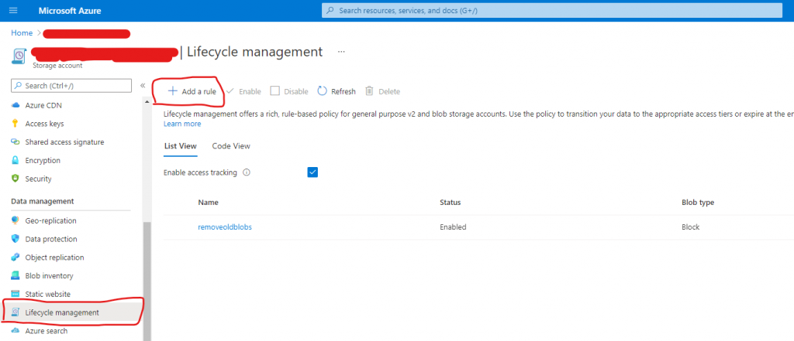
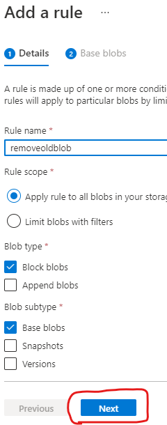
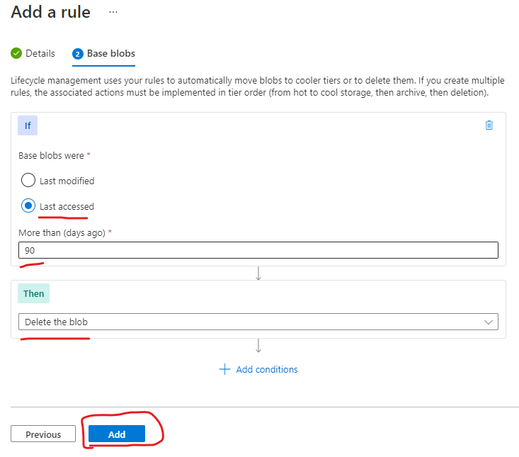
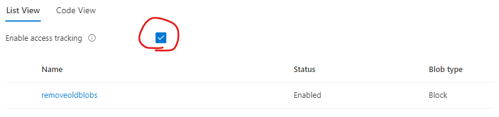

I host my Angular websites using Azure and I use Application Insights to find and report errors. Normally, the exception gets logged, but Angular builds usually have minified javascript, making it hard to debug the origin of an error.

Luckily, Azure support uploading the sourcemaps of a minified Javascript bundle to a Azure Blob Storage Container, which can then be used by Azure's Application Insights to un-minify the stack trace of an error.

To upload these sourcemaps, you will have to integrate this process into your CI/CD pipeline. Set `sourceMap: true` in your `angular.json` configuration file, so that the build outputs the sourcemap files. Then, publish a separate artifact in your build pipeline that can be uploaded to the blob storage container in your release pipeline using Azure File Copy.

Angular build outputs javascript files (and therefore sourcemap files) with unique cache-breaking ids in their filenames. This means that the release pipeline _always_ uploads new, unique sourcemap files. Consequently, if you deploy often enough, sourcemap files will accumulate pretty fast. A project I'm working on has 5 angular apps and a few months of deploys to a test and production environment already uses almost 4GB of storage.

Ideally, I would delete old sourcemap files during the deploy of a new build. Currently, however, the sourcemap blobs have no reference to the app and build they belong to.

A pragmatic solution could then be to delete all blobs that have not been used in the last 90 days. A sourcemap that has not been used for 90 days means that:

1. The app has not generated any or enough errors and can therefore be considered to be very stable.
2. The sourcemaps have not been read because a newer version has already been deployed.

Obviously, you can argue that 60, 120 or xx days is better than 90 days, but the most important thing for me is that the storage container does not get too big. With 90 days I can be sure that my container will never get bigger than 4GB and that's enough for me.

When I do find a way to target the exact sourcemaps that will become obsolete after a new deploy I will let you know of course.

## But Ainab, how do I do this?

In Azure, go to the Storage Account to which your Blob Storage Container belongs. Then go to _Lifecycle management_, and click the  
`+ Add a rule` button:

Go to Lifecycle management of container's Storage Account

Give the new rule a name, such as: `removeoldblobs`. Leave the other options _as is_ and click next.

Use _Last accessed_, _90 days_ and then _Delete the blob._

Select _Last accessed_ (not last modified) to ensure it checks for the last usage. Set it to 90 days or a timespan of your choice. Select _Delete the blob_ as the desired result and click the `Add` button. Your rule should now be present in the list:

Don't forget to enable access tracking

I am not entirely sure how important it is, but I would advise to enable access tracking (see screenshot above). I assume Azure uses this to track whether a file has been accessed in the last 90 days and can then delete the blob if that is the case.
