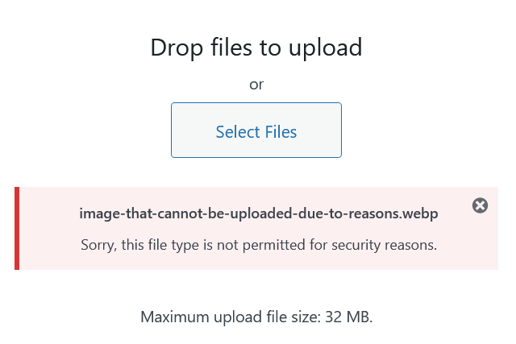
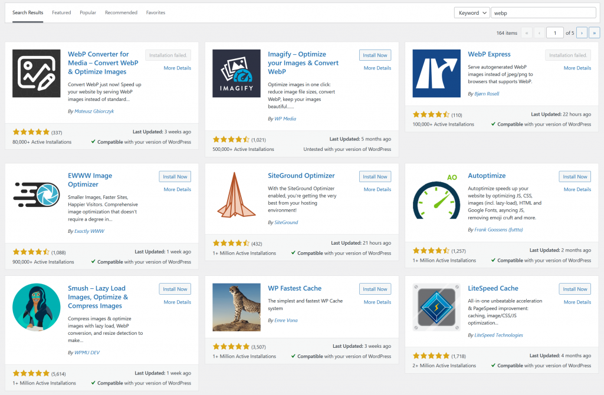

Today, I wanted to upload a [WebP](https://en.wikipedia.org/wiki/WebP) image to a Wordpress website, because we all know WebP is the [superior image format](https://developers.google.com/speed/webp/faq) nowadays.

Unfortunately, Wordpress currently (I am using 5.7.2) does not support it. Wordpress 5.8, however, is said to support WebP.

At the moment of writing, Wordpress 5.8 has not been released yet. So, if you cannot wait until the release of Wordpress 5.8, we will have to find another solution.



_Sorry, this file type is not permitted for security reasons_ is what you'll get when you try to upload a WebP image.

There are two solutions for adding WebP support to your Wordpress website.

### 1\. Use a plugin

The easiest way is to install a plugin that adds support for WebP. There are many plugins that add WebP support to your website. Just use the plugin search bar and results will pop up:



The WebP plugin search results.

A lot of these plugins do way more than only provide WebP support and provide features you will never use. They also can significantly slow down your website and add security risks to your website if the plugin is not maintained regularly.

One option could be to try and find a plugin that is regularly updated and has only one responsibility: To support WebP.

I could not find a regularly updated, single purpose plugin with enough Active Installations and I am also not a big fan of installing plugins for every single problem. Besides, I want to know _why_ WebP is not supported.

Therefore, I prefer the following solution:

### 2\. Add WebP support through your Wordpress theme

This is only a question of adding some lines to your `functions.php` file.

First, to allow for uploading WebP files, add the following lines to your `functions.php` file:

```
/**
 * Add support for WebP images.
 */
function webp_upload_mimes($existing_mimes)
{
  $existing_mimes['webp'] = 'image/webp';
  return $existing_mimes;
}
add_filter('mime_types', 'webp_upload_mimes');
```

Source: [article from Marius](https://mariushosting.com/how-to-upload-webp-files-on-wordpress/), please [donate](https://mariushosting.com/support-my-work/) if it is worth something to you

Then, to add support for WebP thumbnails, add the following lines to your `functions.php` file:

```
/**
 * Enable WebP image thumbnails
 */
function webp_is_displayable($result, $path)
{
  if ($result === false) {
    $displayable_image_types = array(IMAGETYPE_WEBP);
    $info = @getimagesize($path);

    if (empty($info)) {
      $result = false;
    } elseif (!in_array($info[2], $displayable_image_types)) {
      $result = false;
    } else {
      $result = true;
    }
  }

  return $result;
}
add_filter('file_is_displayable_image', 'webp_is_displayable', 10, 2);
```

And that's it! WebP now works on your Wordpress website.
