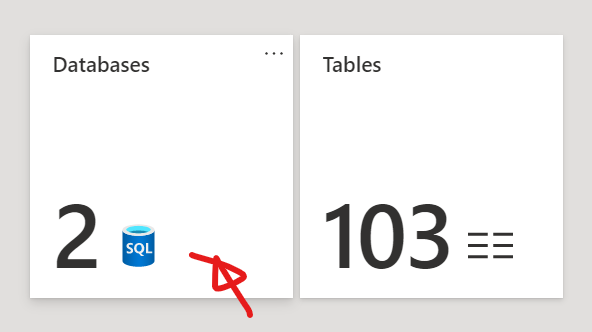
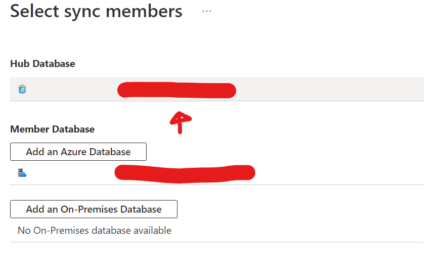
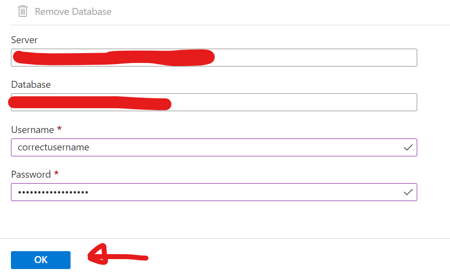

As I was trying to sync my Hub database to my Member database in Azure Database Sync, I got this error when trying to fetch the schema of the Hub database:

```generic
Getting schema information for the database failed with the exception "Failed to connect to server databasename-0182730712073.database.windows.net.Inner exception: SqlException ID: {someGuid}, Error Code: -2146232060 - SqlError Number:40531, Message: SQL error with code 40531  For more information, provide tracing ID ‘{someGuid}’ to customer support."
```

Apparently, the problem was gone once I (re-)entered the SQL Server credentials for the Hub database. Click Databases:



Click Databases

Then, select your Hub Database:



Select the Hub Database

Correctly (re-)enter your credentials and hit OK:



Correctly (re-)enter your credentials and hit OK
