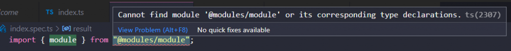

In a Typescript project I am working on, I use tsconfig's `paths` property to create local modules that I can refer to in the project's import without having to type a long relative directory.

E.g. Instead of typing:

```typescript
import { module } from '../../../modules/module';
```

I want to type:

```typescript
import { module } from '@modules/module';
```

To accomplish this, I have added the `paths` property to my root-level `tsconfig.json` file:

```json
// Root-level tsconfig
// File:  ./tsconfig.json

{
  "compilerOptions": {
    "baseUrl": "./",
    "sourceMap": true,
    "declaration": false,
    "moduleResolution": "node",
    "emitDecoratorMetadata": true,
    "experimentalDecorators": true,
    "target": "es2015",
    "allowSyntheticDefaultImports": true,
    "paths": {
      "@modules/\*": \["modules/\*"\]
    }
  }
}
```

Now I could import modules using the `@modules` prefix. However, in my tests' `*.spec.ts` files, I could still not use the prefix, resulting in the following error:



Cannot find module '@modules/module' or its corresponding type declarations. ts(2307)

So, after some searching, I found a solution. I had to add an `include` to my tsconfig file that would explicitly include `*.spec.ts` files:

```json
// Root-level tsconfig
// File:  ./tsconfig.json

{
  "compilerOptions": {
    "baseUrl": "./",
    "sourceMap": true,
    "declaration": false,
    "moduleResolution": "node",
    "emitDecoratorMetadata": true,
    "experimentalDecorators": true,
    "target": "es2015",
    "allowSyntheticDefaultImports": true,
    "paths": {
      "@modules/\*": \["modules/\*"\]
    }
  },
  "include": \["./\*\*/\*.spec.ts"\]
}
```

But after adding this `include`, I was still receiving the error! After some soul searching, it turned out to be the sub-project's tsconfig file's `include` property that was overriding the root-level's tsconfig `include` property:

```json
// Sub-project tsconfig
// File:  ./sub-project/tsconfig.json

{
  "extends": "../tsconfig.json",
  "include": \["./\*\*/\*.d.ts"\]
}
```

In my sub-project I include several typescript typing files for reasons I shall not bore you with.

Although I was extending the root-level tsconfig file, the sub-project `include` values were overriding (not merging / assigning) the root-level `include` values.

There are two solutions to this problem:

#### 1\. Remove the `include` property from the sub-project tsconfig

If you remove the `include` property from the sub-project's tsconfig file, the root-level `include` won't be overridden. However, the `*.d.ts` files are now also not included anymore. You should therefore add those to the root-level tsconfig's `include` values:

```json
// Sub-project tsconfig
// File:  ./sub-project/tsconfig.json

{
  "extends": "../tsconfig.json"
}
```

```json
// Root-level tsconfig
// File:  ./tsconfig.json

{
  "compilerOptions": {
    "baseUrl": "./",
    "sourceMap": true,
    "declaration": false,
    "moduleResolution": "node",
    "emitDecoratorMetadata": true,
    "experimentalDecorators": true,
    "target": "es2015",
    "allowSyntheticDefaultImports": true,
    "paths": {
      "@modules/\*": \["modules/\*"\]
    }
  },
  "include": \["./\*\*/\*.spec.ts", "./\*\*/\*.d.ts"\]
}

```

#### 2\. Include the `*.spec.ts` files to the sub-project tsconfig' `include` values

If you only want to include the `*.d.ts` files in your sub-project and not at root-level, you only need to include the `*.spec.ts` into the sub-project's tsconfig:

```json
// Sub-project tsconfig
// File:  ./sub-project/tsconfig.json

{
  "extends": "../tsconfig.json",
  "include": \["./\*\*/\*.spec.ts", "./\*\*/\*.d.ts"\]
}
```
