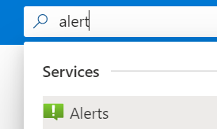
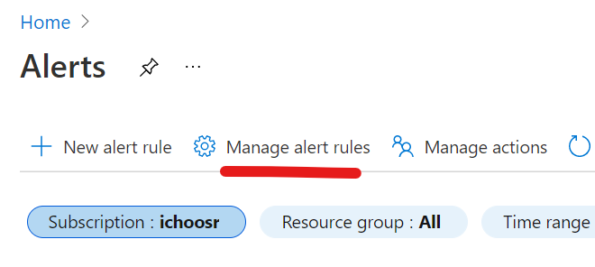
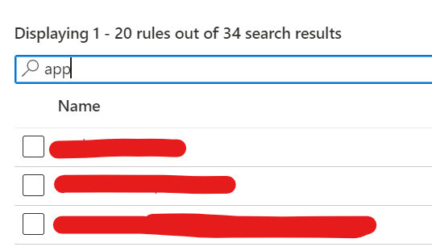
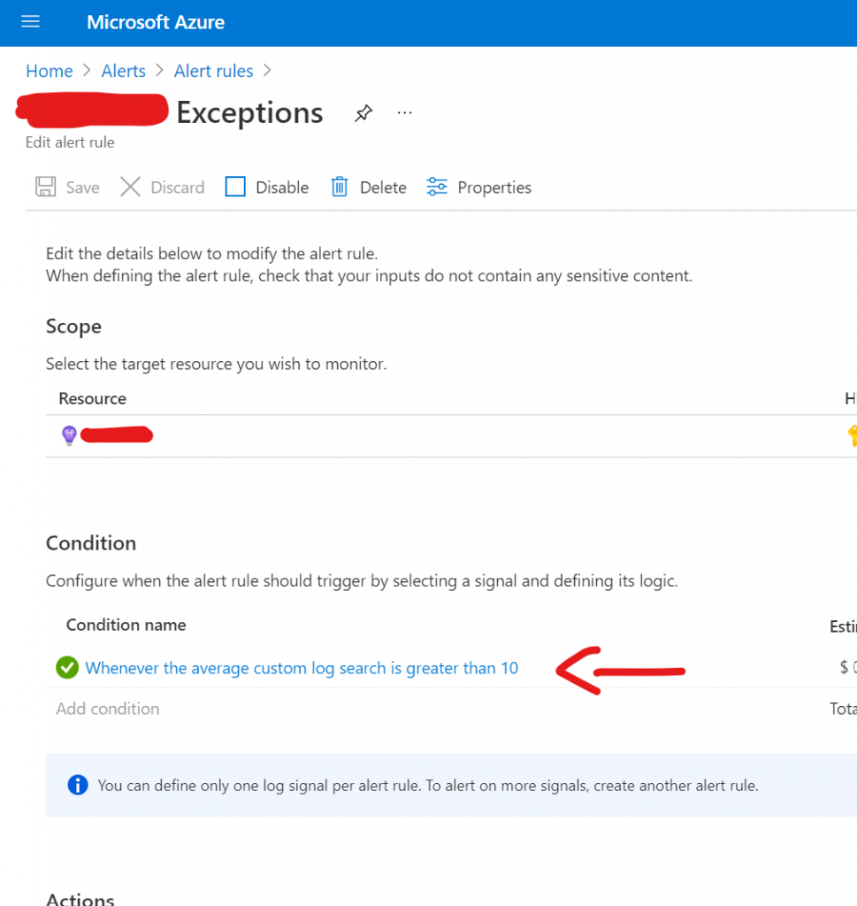
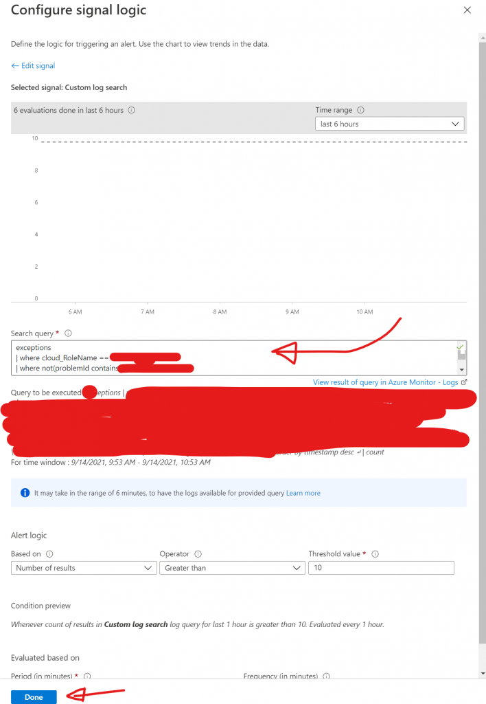
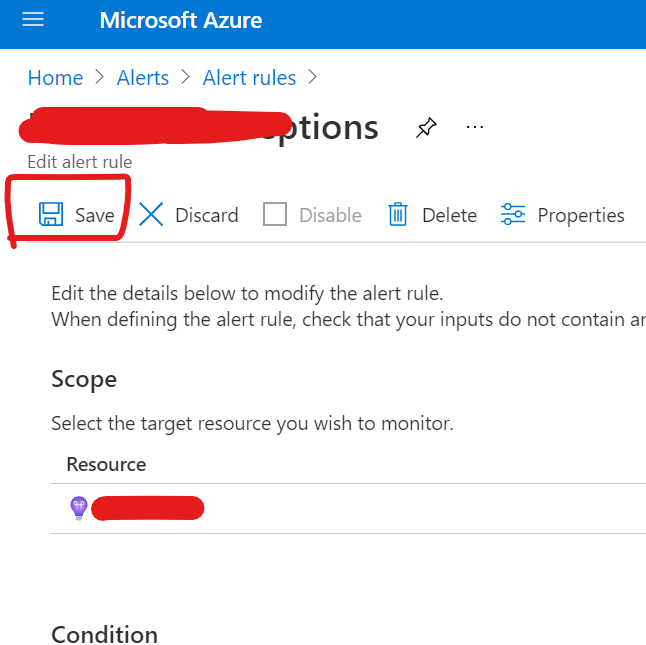

For a lot of people probably a piece of cake, but I had to look a while before I could find it.

In Azure Portal, go to Alerts.

Go to `Manage alert rules`.

App names are hidden because of privacy reasons

Go to the application for which you want to edit the query.

Click on the condition whose query needs to be edited.

Edit the query in the textarea and click `Done`.

Don't forget to save your changes!
