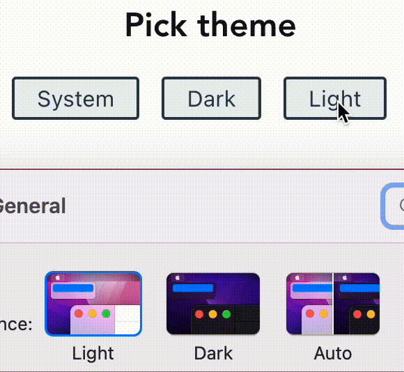

**tl;dr - A vue.js example of adding dark mode support to your website that takes system preference and user preference into account. See [link](https://github.com/drikusroor/vuejs-dark-mode) for source.**

When you are developing a website with dark-mode support, there are usually two paths you can take:

1. Use the `[prefers-color-scheme](https://developer.mozilla.org/en-US/docs/Web/CSS/@media/prefers-color-scheme)` CSS media feature and thereby use the system preference.
2. Use a website setting to set a `.dark` (or similar) class on the body element of the website

But both options have its negative aspects. If you use `prefers-color-scheme` to control the color scheme of the website, the user has no control over the color scheme except by changing the system preference. On the other hand, if you use a settings in your website to control the color scheme, the system preference gets overlooked.

To combine both settings would therefore create a better user experience. In the table below I sketched a situation of how this might behave:

<table><tbody><tr><td><strong>Website preference</strong></td><td><strong>System preference</strong></td><td><strong>Result</strong></td></tr><tr><td>Dark</td><td>/ignore</td><td>Dark</td></tr><tr><td>Light</td><td>/ignore</td><td>Light</td></tr><tr><td>System</td><td>Dark</td><td>Dark</td></tr><tr><td></td><td>Light</td><td>Light</td></tr><tr><td></td><td>Auto</td><td>Dark / light<br>(depending on the time of day, for example)</td></tr></tbody></table>

Website preference trumps system preference

Whenever the website preference has been set to `dark` or `light`, the system preference will be ignored. However, when the website preference has been set to `system`, the system (or browser) preference will be inherited.

Now, how do you do this in Vue.js and how do you combine the `prefers-color-scheme` with a website setting?

### Give the user options

First, I will create a `[reactive](https://vuejs.org/guide/scaling-up/state-management.html#simple-state-management-with-reactivity-api)` store and a component to give the user the opportunity to pick a preference:

```typescript
// theme.store.ts
import { reactive } from "vue";

export const themeStore = reactive({
  theme: 'system'
});
```

```typescript
// ThemeSettings.vue (typescript)
<script lang="ts">
import { themeStore } from "@/store/theme.store";
import themeService from "@/services/theme.service";
import { defineComponent } from "vue";

export default defineComponent({
  data() {
    return {
      themeStore,
    };
  },
  methods: {
    onChangeTheme(theme: string) {
      this.themeStore.theme = theme;
      themeService.updateTheme();
    },
  },
});
</script>
```

```html
<!-- ThemeSettings.vue (template) -->
<template>
  <h2>Pick theme</h2>
  <div class="button-group">
    <button type="button" @click="onChangeTheme('system')">System</button>
    <button type="button" @click="onChangeTheme('dark')">Dark</button>
    <button type="button" @click="onChangeTheme('light')">Light</button>
  </div>
</template>
```

Here, we allow the user to pick between a `system`, `dark`, and `light` color scheme preference. Picking the `system` option should eventually cause the website to inherit the system color scheme preference.

Whenever the user picks a preference, this preference is persisted into the store and the `themeService.updateTheme()` method is triggered. This last method will make sure the theme will actually be applied to the website and will be explained below.

### Take `prefers-color-scheme` into account

To know about the color scheme preference at the system level we need to:

1. Get the preference during the initialization of the app
2. Watch for preference changes later on

To see if the initial preference is set to dark, we can use the following line of code:

```typescript
const darkThemePreference = window.matchMedia("(prefers-color-scheme: dark)").matches;
```

To watch for changes in system preference later on in the lifecycle of the app, we can use:

```typescript
window
  .matchMedia("(prefers-color-scheme: dark)")
  .addEventListener("change", (): void => {
    // Do something;
  });
```

If we combine all this logic in a service (the `themeService`), it would look like this:

```typescript
import { themeStore } from "@/store/theme.store";

export default {
  initializeTheme(): void {
    this.updateTheme();
    this.watchGlobalThemePreference();
  },
  getTheme(): string {
    const preference = themeStore.theme;
    if (preference === "system") {
      if (
        window.matchMedia &&
        window.matchMedia("(prefers-color-scheme: dark)").matches
      ) {
        return "dark";
      } else {
        return "light";
      }
    } else {
      return preference;
    }
  },
  updateTheme() {
    const theme = this.getTheme();
    document.documentElement.setAttribute("theme", theme);
  },
  watchGlobalThemePreference() {
    window
      .matchMedia("(prefers-color-scheme: dark)")
      .addEventListener("change", (): void => {
        this.updateTheme();
      });
  },
};
```

The `getTheme()` method returns the current theme preference and takes both the system preference as well as the website preference into account. If the website preference is set to `system`, it will return the system color scheme preference and when the website color scheme preference is set to dark or light, it will return those respective preferences. It will therefore always return either `"dark"` or `"light"`.

The `updateTheme()` uses the `getTheme()` to get the current theme preference and then adds the `theme="dark|light"` attribute to the document root: `<html theme="dark">`. We can then use this attribute to use different colors and styles between dark and light mode in our CSS.

The last method, `watchGlobalThemePreference()`, adds an event listener that will watch changes in the color scheme preference on the system level and will trigger the `updateTheme()` methods whenever a change in system preference has been detected. This makes sure that system color scheme preferences changes later in the lifecycle of the app also trigger a theme change.

This last method has to be executed only once, during the startup of our app:

```typescript
// App.vue
<script lang="ts">
import { defineComponent } from "vue";
import themeService from "@/services/theme.service";

export default defineComponent({
  created() {
    themeService.initializeTheme();
  },
});
</script>
```

Now that the logic of combining `prefers-color-scheme` while giving the user the possibility to override that system color scheme preference is complete, we can have a look of how to integrate our CSS.

As I have written before, the change of a system preference or the website preference will cause the attribute `theme="dark|light"` to be set onto the `<html>` tag. We can use this attribute to show different colors and styles per theme:

```css
/\* App.vue \*/

<style>
/\* default theme \*/
:root {
   --color-background: #fff;
   --color-text:       #111;
}

/\* dark theme \*/
:root\[theme="dark"\] {
   --color-background: #333;
   --color-text:       #ddd;
}

body, h2 {
  background: var(--color-background);
  color: var(--color-text);
}
</style>
```

The result looks like this:



Source code can be found [here](https://github.com/drikusroor/vuejs-dark-mode).
