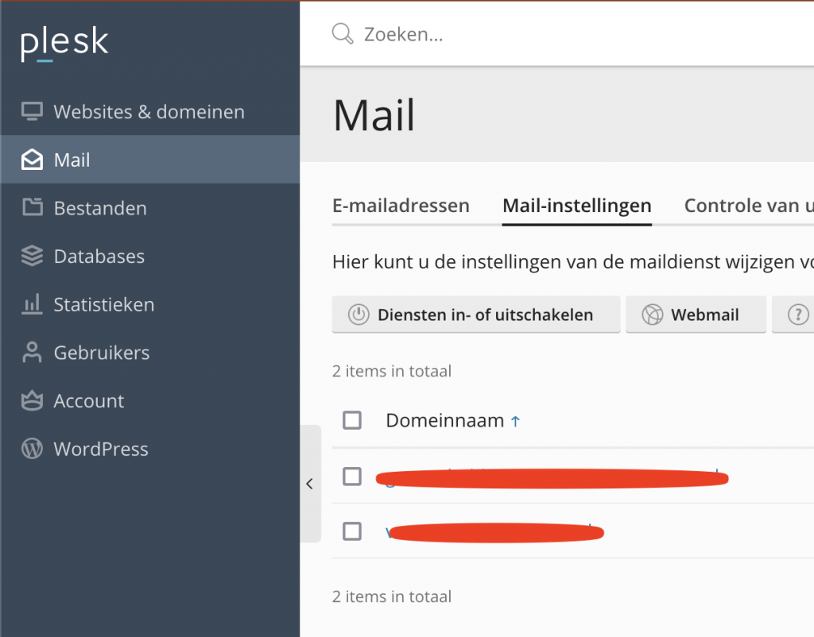
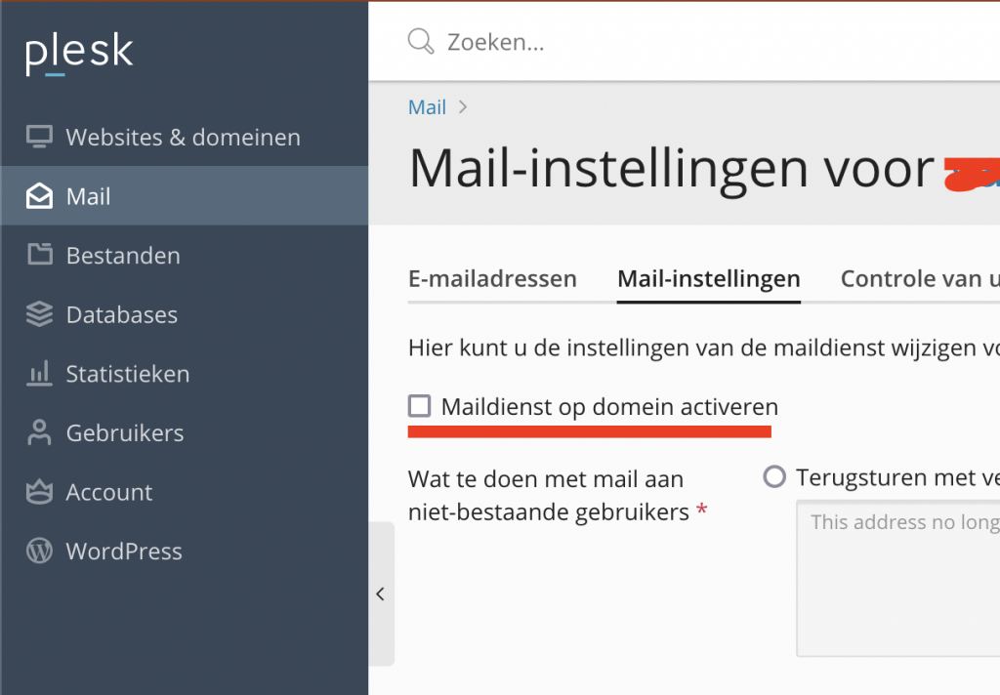

Imagine the following situation: You have a Wordpress website hosted on example.com. The host has a Plesk configuration panel. Your email is handled by Google Workspace. MX records have been configured for this in Plesk, as described [here](https://support.google.com/a/answer/9174449?hl=en&ref_topic=4446024). The website has a contact form that should send an email to you, the owner of the website, on info@example.com.

But... the emails are not arriving. You try a different email address, outside of your domain, like example@gmail.com. This works, but it is not the desired solution.

Apparently, Wordpress, using wp\_mail, [which uses PHPMailer under the hood](https://developer.wordpress.org/reference/functions/wp_mail/), tries to send this email internally. Therefore, the email will not reach the @example.com email addresses configured in Google Workspace through the MX records.

To fix this, the only thing we have to do is turn off the Email Service in Plesk. Go to _Mail > Mail-settings_\* and click on the domain in question.

Mail settings

Then, make sure the _Active mail service on domain_\* checkbox is turned off and submit the form on the bottom of the page.

Now, PHPMailer won't try to send emails internally anymore and instead will use the MX Records to send emails, meaning emails to email addresses of the same domain as the website should arrive in Google Workspace or the service of your choice.

\* The exact naming might be different as my Plesk is in Dutch and I'm translating the Dutch texts to English myself.
